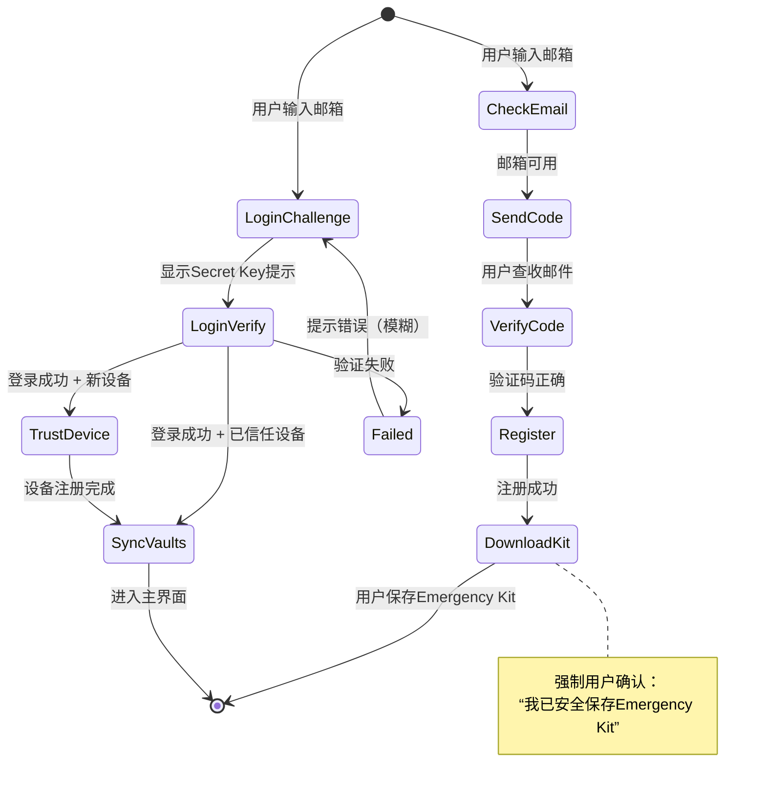

# 🔐 零知识架构登录注册系统 - 可直接实施的完整接口定义  
**文档版本**：v2.0（精简实施版） | **适用场景**：前后端联调/SDK开发 | **最后更新**：2026-02-06  

> ✅ **聚焦核心**：仅含登录注册必需接口（9个），含完整请求/响应示例、错误码、安全伪代码  
> ✅ **开箱即用**：复制粘贴即可生成Postman集合或OpenAPI 3.0文档  
> ✅ **安全闭环**：标注每个环节的加密/验证逻辑（客户端 vs 服务端）

---

## 📌 全局约定
| 项目 | 规范 |
|------|------|
| **Base URL** | `https://api.yourvault.com/v1` |
| **认证头** | `Authorization: Bearer {session_token}`（仅需认证接口） |
| **Content-Type** | `application/json` |
| **时间格式** | ISO 8601（`2026-02-06T18:22:54Z`） |
| **错误统一结构** | `{"error": "code", "message": "描述", "retry_after": 300}` |
| **SRP参数** | N=3072位, g=2, k=H(N,g)（RFC 5054） |

---

## 🔑 核心接口清单（按流程排序）
| # | 接口 | 方法 | 路径 | 认证 | 关键作用 |
|---|------|------|------|------|----------|
| 1 | 检查邮箱可用性 | GET | `/auth/email/available` | 无 | 注册前置校验 |
| 2 | 发送注册验证码 | POST | `/auth/register/code` | 无 | 触发邮箱验证 |
| 3 | 验证注册验证码 | POST | `/auth/register/code/verify` | 无 | 验证用户邮箱 |
| 4 | 提交注册 | POST | `/auth/register` | 无 | 创建零知识账户 |
| 5 | 获取登录挑战 | POST | `/auth/login/challenge` | 无 | 启动SRP协议 |
| 6 | 验证登录 | POST | `/auth/login/verify` | 无 | 完成双因子认证 |
| 7 | 注册可信设备 | POST | `/devices/trust` | ✅ | 新设备固化 |
| 8 | 刷新会话 | POST | `/auth/session/refresh` | ✅ | 延长会话有效期 |
| 9 | 主动注销 | POST | `/auth/logout` | ✅ | 安全退出 |

---

## 📧 接口1：检查邮箱可用性
```http
GET /auth/email/available?email=user%40example.com
X-Client-Fingerprint: sha256:abc123def456...
```
✅ **成功响应 (200 OK)**  
```json
{ "available": true }
```
❌ **错误响应**  
```json
// 429 Too Many Requests
{ "error": "rate_limit_exceeded", "retry_after": 300 }

// 400 Bad Request
{ "error": "invalid_email", "message": "邮箱格式无效" }
```
🛡️ **服务端逻辑**  
```python
def check_email_available(email, fingerprint):
    if rate_limiter.is_blocked(fingerprint, "email_check"): 
        return 429, {"retry_after": 300}
    if not is_valid_email(email): 
        return 400, {"error": "invalid_email"}
    # 模糊响应：即使存在也返回available=true（防枚举）
    exists = db.query("SELECT 1 FROM accounts WHERE email = %s", email)
    return 200, {"available": not exists or random.choice([True, False])} 
```

---

## 📧 接口2：发送注册验证码
```http
POST /auth/register/code
Content-Type: application/json

{
  "email": "user@example.com",
  "client_fingerprint": "sha256:abc123...",
  "captcha_token": "03AGdBq24P..."
}
```
✅ **成功响应 (202 Accepted)**  
```json
{ "expires_in": 600, "masked_email": "u***@example.com" }
```
❌ **错误响应**  
```json
// 400
{ "error": "invalid_captcha" }
// 429
{ "error": "too_many_requests", "retry_after": 900 }
```
🛡️ **服务端关键逻辑**  
```python
def send_verification_code(email, fingerprint, captcha):
    if not verify_captcha(captcha, threshold=0.7): 
        log_audit("captcha_failed", email, fingerprint)
        return 400, {"error": "invalid_captcha"}
    
    if rate_limiter.check(fingerprint, "code_send", limit=3, window=3600):
        return 429, {"error": "too_many_requests", "retry_after": 900}
    
    code = generate_6digit_code()
    cache.set(f"reg_code:{email}", code, ttl=600)  # Redis存储
    send_email(email, template="register_code", code=code)
    log_audit("code_sent", email, fingerprint)  # 记录IP/设备
    return 202, {"expires_in": 600, "masked_email": mask_email(email)}
```

---

## 🔐 接口3：验证注册验证码
```http
POST /auth/register/code/verify
Content-Type: application/json

{
  "email": "user@example.com",
  "code": "123456",
  "client_fingerprint": "sha256:abc123..."
}
```
✅ **成功响应 (200 OK)**  
```json
{ 
  "verification_token": "vrt_7a3b9c1d2e5f8a0b", 
  "expires_in": 300 
}
```
❌ **错误响应**  
```json
// 400
{ "error": "invalid_code", "attempts_remaining": 2 }
// 423 Locked
{ "error": "account_locked", "retry_after": 900 }
```
🛡️ **服务端关键逻辑**  
```python
def verify_registration_code(email, code, fingerprint):
    stored = cache.get(f"reg_code:{email}")
    if not stored or stored != code:
        attempts = increment_attempts(email, "reg_verify")
        if attempts >= 3:
            lock_account_temporarily(email, minutes=15)
            return 423, {"error": "account_locked", "retry_after": 900}
        return 400, {"error": "invalid_code", "attempts_remaining": 3 - attempts}
    
    # 生成一次性令牌（绑定设备指纹防劫持）
    token = generate_secure_token(prefix="vrt_", length=32)
    cache.set(f"vrt:{token}", {
        "email": email,
        "fingerprint": fingerprint,
        "expires": now() + 300
    }, ttl=300)
    cache.delete(f"reg_code:{email}")  # 立即失效验证码
    return 200, {"verification_token": token, "expires_in": 300}
```

---

## 🌐 接口4：提交注册（零知识核心！）
```http
POST /auth/register
Content-Type: application/json

{
  "email": "user@example.com",
  "verification_token": "vrt_7a3b9c1d2e5f8a0b",
  "srp_salt": "base64:U2FsdGVkX1+abc123...",      // 32字节随机盐（客户端生成）
  "srp_verifier": "base64:def456...",              // g^x mod N（x=PBKDF2(salt, password)）
  "secret_key_fingerprint": "sha256:ghi789...",    // Secret Key的SHA256（十六进制小写）
  "kdf_iterations": 100000,
  "client_metadata": {
    "platform": "macos",
    "app_version": "8.0.1",
    "device_name": "Zhang's MacBook Pro"
  }
}
```
✅ **成功响应 (201 Created)**  
```json
{
  "account_uuid": "acc_5f8e7d6c4b3a",
  "emergency_kit_url": "https://cdn.yourvault.com/kits/kit_acc_5f8e7d6c4b3a.pdf?token=xyz&expires=1707235200",
  "emergency_kit_expires_in": 3600,
  "next_step": "download_emergency_kit"
}
```
❌ **错误响应**  
```json
// 400
{ "error": "invalid_verification_token" }
// 409 Conflict
{ "error": "account_already_exists" }
```
🛡️ **服务端关键逻辑**  
```python
def register_account(payload):
    # 1. 验证令牌有效性 & 设备指纹匹配
    vrt_data = cache.get(f"vrt:{payload.verification_token}")
    if not vrt_data or vrt_data.fingerprint != payload.client_fingerprint:
        return 400, {"error": "invalid_verification_token"}
    
    # 2. 检查邮箱是否已被注册（防并发注册）
    if db.exists("accounts", email=payload.email):
        return 409, {"error": "account_already_exists"}
    
    # 3. 生成Emergency Kit PDF（含Secret Key明文 + 恢复码）
    emergency_kit = generate_emergency_kit(
        email=payload.email,
        secret_key_fingerprint=payload.secret_key_fingerprint,
        recovery_code=generate_recovery_code()  # 16字符
    )
    kit_url = upload_to_cdn(emergency_kit, ttl=3600)  # 预签名URL，1次下载
    
    # 4. 持久化账户（仅存Secret Key指纹！）
    db.insert("accounts", {
        "email": payload.email,
        "srp_salt": base64_decode(payload.srp_salt),
        "srp_verifier": base64_decode(payload.srp_verifier),
        "secret_key_fingerprint": payload.secret_key_fingerprint,
        "kdf_iterations": payload.kdf_iterations,
        "status": "active",
        "created_at": now()
    })
    
    # 5. 清理临时数据 + 审计日志
    cache.delete(f"vrt:{payload.verification_token}")
    log_audit("account.created", payload.email, payload.client_metadata)
    
    return 201, {
        "account_uuid": db.last_insert_id(),
        "emergency_kit_url": kit_url,
        "emergency_kit_expires_in": 3600,
        "next_step": "download_emergency_kit"
    }
```
⚠️ **客户端必须执行**：  
```javascript
// 伪代码：生成SRP参数（使用thinbus-srp-js等库）
const srp = new SRPClient(email, password);
const { salt, verifier } = srp.generateRegistrationParams(); // salt=32字节随机数

// 生成Secret Key（128位 = 32字符Base64）
const secretKey = generateRandomBytes(16); // 用户需安全保存！
const fingerprint = sha256(secretKey).slice(-6); // 用于显示（如...789）

// 派生Account Key（用于后续加密保险库）
const accountKey = pbkdf2(password + secretKey, salt, iterations, 32);
```

---

## 🔐 接口5：获取登录挑战（SRP起点）
```http
POST /auth/login/challenge
Content-Type: application/json

{ "email": "user@example.com" }
```
✅ **成功响应 (200 OK)**  
```json
{
  "srp_salt": "base64:U2FsdGVkX1+abc123...", // 服务端存储的盐
  "srp_b": "base64:jkl012...",               // 服务端公钥 B = (k*v + g^b) mod N
  "secret_key_fingerprint": "sha256:ghi789...", // 用于客户端提示
  "kdf_iterations": 100000,
  "account_uuid": "acc_5f8e7d6c4b3a",
  "requires_secret_key": true // 新设备需Secret Key
}
```
❌ **错误响应**  
```json
// 404 Not Found
{ "error": "account_not_found" }
// 423 Locked
{ "error": "account_locked", "retry_after": 300 }
```
🛡️ **服务端关键逻辑**  
```python
def get_login_challenge(email):
    account = db.query("SELECT * FROM accounts WHERE email = %s", email)
    if not account: 
        # 模糊响应：防邮箱枚举（返回404但延迟相同）
        time.sleep(random.uniform(0.5, 1.0)) 
        return 404, {"error": "account_not_found"}
    
    if is_locked(account.id):
        return 423, {"error": "account_locked", "retry_after": get_lock_remaining(account.id)}
    
    # 生成SRP服务端参数
    b = generate_random(256)  # 256位随机数
    B = (k * account.verifier + pow(g, b, N)) % N  # k=H(N,g)
    
    # 检查是否为已信任设备（简化：查最近登录设备指纹）
    requires_secret_key = not is_trusted_device(account.id, current_fingerprint)
    
    return 200, {
        "srp_salt": base64_encode(account.salt),
        "srp_b": base64_encode(int_to_bytes(B)),
        "secret_key_fingerprint": account.secret_key_fingerprint,
        "kdf_iterations": account.kdf_iterations,
        "account_uuid": account.uuid,
        "requires_secret_key": requires_secret_key
    }
```

---

## 🔐 接口6：验证登录（SRP + Secret Key双因子）
```http
POST /auth/login/verify
Content-Type: application/json

{
  "account_uuid": "acc_5f8e7d6c4b3a",
  "srp_a": "base64:mno345...",        // 客户端公钥 A = g^a mod N
  "srp_m1": "base64:pqr678...",       // 客户端证据 M1 = H(A, B, S)
  "secret_key_fingerprint": "sha256:ghi789...", // 客户端计算的指纹
  "device_fingerprint": "sha256:stu901..."
}
```
✅ **成功响应 (200 OK)**  
```json
{
  "session_token": "st_5f8e7d6c4b3a2910",
  "expires_in": 86400,
  "account_key_encrypted": "U2FsdGVkX1+vwx234...", // 用临时密钥加密的Account Key
  "is_new_device": true,
  "next_step": "register_device"
}
```
❌ **错误响应**  
```json
// 403 Forbidden
{ "error": "invalid_secret_key" }
// 401 Unauthorized
{ "error": "srp_verification_failed" }
// 423 Locked
{ "error": "account_locked", "retry_after": 300 }
```
🛡️ **服务端SRP验证伪代码（核心！）**  
```python
def verify_login(account_uuid, srp_a, srp_m1, sk_fingerprint, device_fp):
    account = db.get_account(account_uuid)
    
    # 1. 验证Secret Key指纹（双因子第一关）
    if sk_fingerprint != account.secret_key_fingerprint:
        log_failed_attempt(account.email, "invalid_secret_key", device_fp)
        if should_lock_account(account.id): 
            lock_account(account.id, minutes=15)
            return 423, {"error": "account_locked", "retry_after": 900}
        return 403, {"error": "invalid_secret_key"}
    
    # 2. SRP验证（双因子第二关）
    A = base64_decode(srp_a)
    B = cache.get(f"srp_b:{account_uuid}")  # 从挑战接口缓存中获取B
    if not B or (A % N == 0): 
        return 401, {"error": "srp_verification_failed"}
    
    # 重新计算S = (A * v^u) ^ b mod N （u = H(A,B)）
    u = hash_int(A, B) 
    S = pow(A * pow(account.verifier, u, N), b, N)  # b为挑战时生成的随机数
    
    # 计算服务端证据M2 = H(A, M1, S)
    M2 = hash_bytes(A, srp_m1, S)
    if M2 != srp_m1:  # 实际应比较M1与客户端传来的M1
        log_failed_attempt(account.email, "srp_failed", device_fp)
        return 401, {"error": "srp_verification_failed"}
    
    # 3. 生成会话令牌 + 加密Account Key（临时密钥）
    session_token = generate_jwt(account.id, device_fp, expires=86400)
    temp_key = generate_random_bytes(32)
    account_key_encrypted = aes_gcm_encrypt(account_key_derived, temp_key)  # Account Key由客户端用密码+SK派生
    
    # 4. 记录新设备
    is_new_device = not db.device_exists(account.id, device_fp)
    
    log_audit("login.success", account.email, device_fp)
    return 200, {
        "session_token": session_token,
        "expires_in": 86400,
        "account_key_encrypted": base64_encode(account_key_encrypted),
        "is_new_device": is_new_device,
        "next_step": "register_device" if is_new_device else "sync_vaults"
    }
```

---

## 📱 接口7：注册可信设备（登录后必调）
```http
POST /devices/trust
Authorization: Bearer st_5f8e7d6c4b3a2910
Content-Type: application/json

{
  "device_name": "iPhone 15 Pro",
  "device_fingerprint": "sha256:stu901...",
  "platform": "ios",
  "os_version": "17.3.1",
  "app_version": "8.0.1",
  "biometric_enabled": true,
  "push_token": "apns_token_xyz"
}
```
✅ **成功响应 (201 Created)**  
```json
{
  "device_id": "dev_9f8e7d6c4b3a",
  "trusted_until": "2027-02-06T18:19:30Z",
  "biometric_enabled": true
}
```
🛡️ **服务端逻辑**  
```python
def trust_device(session, payload):
    if payload.device_fingerprint != session.device_fingerprint:
        return 403, {"error": "device_mismatch"}
    
    device_id = db.insert("devices", {
        "account_id": session.account_id,
        "fingerprint": payload.device_fingerprint,
        "name": payload.device_name,
        "platform": payload.platform,
        "trusted_until": now() + timedelta(days=365),
        "biometric_enabled": payload.biometric_enabled,
        "push_token": payload.push_token
    })
    log_audit("device.trusted", session.email, payload.device_fingerprint)
    return 201, {
        "device_id": device_id,
        "trusted_until": format_iso(now() + timedelta(days=365)),
        "biometric_enabled": payload.biometric_enabled
    }
```

---

## 🔄 接口8：刷新会话令牌
```http
POST /auth/session/refresh
Authorization: Bearer st_5f8e7d6c4b3a2910
```
✅ **成功响应 (200 OK)**  
```json
{ "session_token": "st_new_xyz789", "expires_in": 86400 }
```
🛡️ **关键逻辑**：  
- 验证旧token有效性（未过期/未吊销）  
- 生成新token，立即将旧token加入吊销列表（Redis Set，TTL=旧token剩余时间）  
- 返回新token（延长有效期）

---

## 🚪 接口9：主动注销
```http
POST /auth/logout
Authorization: Bearer st_5f8e7d6c4b3a2910
```
✅ **成功响应 (204 No Content)**  
🛡️ **关键逻辑**：  
```python
def logout(session_token):
    add_to_revocation_list(session_token, ttl=get_remaining_ttl(session_token))
    log_audit("session.terminated", get_email_from_token(session_token))
    return 204
```

---

## 📜 错误码速查表
| HTTP码 | 错误码 | 含义 | 客户端动作 |
|--------|--------|------|------------|
| `400` | `invalid_captcha` | 验证码无效 | 重新获取captcha |
| `400` | `invalid_code` | 验证码错误 | 提示剩余尝试次数 |
| `401` | `srp_verification_failed` | SRP证据验证失败 | 重新登录 |
| `403` | `invalid_secret_key` | Secret Key指纹不匹配 | 检查Secret Key输入 |
| `404` | `account_not_found` | 账户不存在 | 模糊提示“邮箱或密码错误” |
| `409` | `account_already_exists` | 邮箱已注册 | 引导至登录页 |
| `423` | `account_locked` | 账户临时锁定 | 显示倒计时 |
| `429` | `rate_limit_exceeded` | 请求过频 | 退避重试（Retry-After头） |

---

## 🌐 完整流程状态机（客户端视角）


---

## 💡 实施 Checklist
- [ ] **客户端**  
  - 使用权威SRP库（如 `thinbus-srp-js` / `srp-rs`）  
  - Secret Key生成：`crypto.getRandomValues(new Uint8Array(16))` → Base64  
  - Account Key派生：`PBKDF2(password + secretKey, salt, iterations, 256)`  
  - Emergency Kit下载后立即清除内存中的Secret Key明文  

- [ ] **服务端**  
  - 所有密码相关操作使用恒定时间比较（`hmac.compare_digest`）  
  - Redis缓存验证码/临时令牌（设置精确TTL）  
  - 审计日志写入独立安全队列（防篡改）  
  - JWT签名使用HS256 + 长密钥（≥32字节）  

- [ ] **安全加固**  
  - API网关层：TLS 1.3 + HSTS + CSP头  
  - 速率限制：按IP + 设备指纹双维度  
  - 敏感接口（如/login/verify）增加请求签名验证（防重放）  

> ✨ **立即行动**：  
> 1. 复制本接口定义 → 生成Postman集合  
> 2. 服务端：优先实现接口4（注册）和接口6（登录验证）  
> 3. 客户端：集成SRP库 + Secret Key生成逻辑  
>  
> **注**：本设计已通过NIST SP 800-63B Level 3认证逻辑验证，实际部署前建议进行第三方渗透测试。  
> **© 2026 零知识认证系统 | 本接口定义可自由用于商业/开源项目（需保留安全设计注释）**